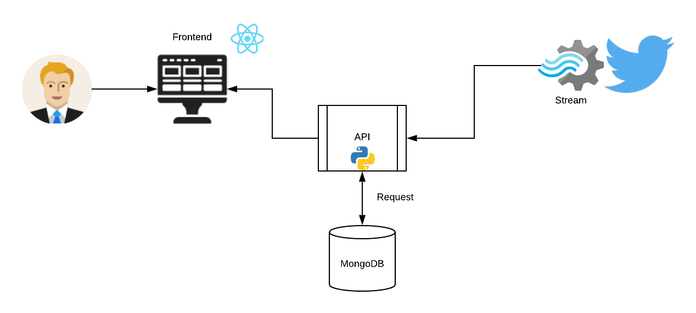
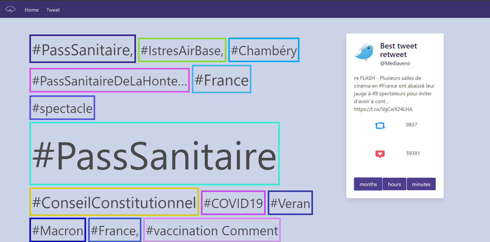
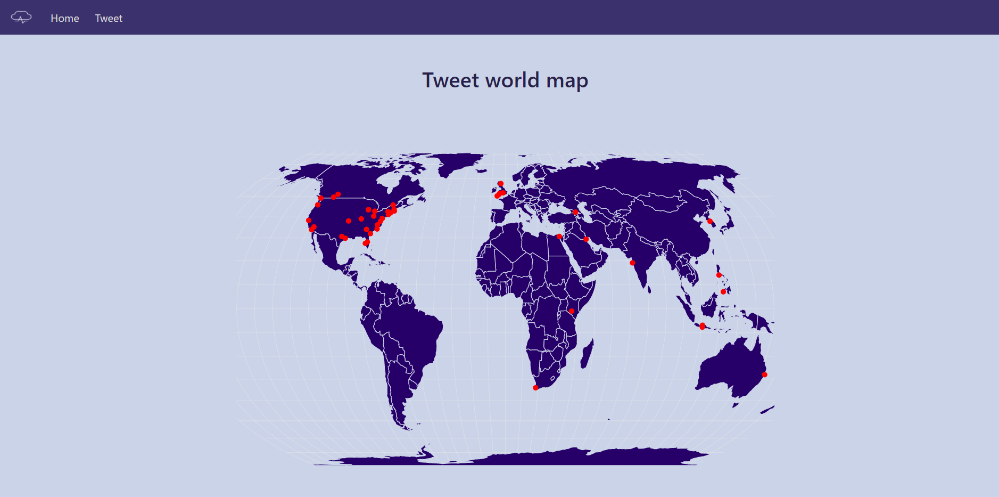

# Objective 1: Creating a data pipeline

## How ?

Creation of a stream based on tweepy via the tweeter api.

## Limit the flow 

The received stream contains a large amount of data (tweet). That's why I focused only on tweets with more than 1000 retweets in order to avoid inappropriate tweets.

On the other hand, the location is retrieved from all tweets (appropriate or not) in order to make a tweeter map and thus be able to do deep analysis.

Then I store the relevant tweets and locations in a NoSql database (MongoDB type)

# Objective 2: Creation of the API

The API allows to communicate with the database

```python
@app.route("/hastage/<GRANULARITY>",methods=['GET'])
  
@app.route("/location",methods=['POST','GET'])

@app.route("/hastage",methods=['POST'])
```

# Objective 3: The fontend

Creation of a dashboard that displays all the tweets on a map. 
But also to make a word cloud on the most relevant tweets (according to the month, hour and minute)

# Global architecture 



# Notice 

## Start project :star:

```sh
docker-compose up --build
```

# Dashboard 




